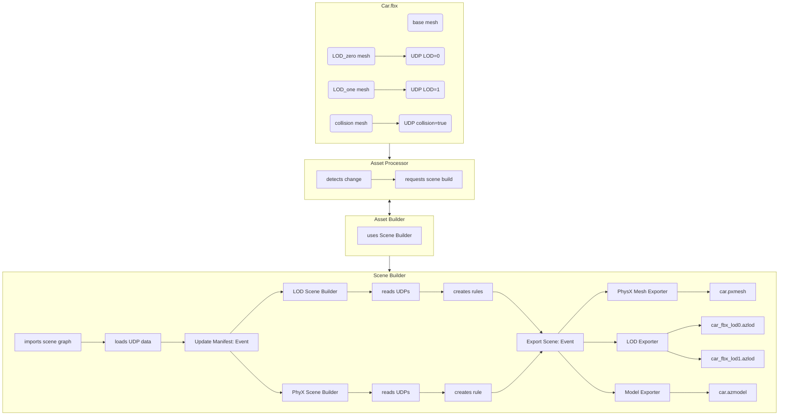

# Scene Building API: User Defined Properties

Artists can store metadata in source scenes to user defined properties (UDP) on scene nodes. This user defined property metadata can be exported into source scene files (i.e. FBX). This metadata is important since it can indicate details about the scene such which mesh nodes to use as level of detail (LOD) and/or physics collision meshes. The best way to store this type of metadata is to use the properties sub-systems used inside the DCC tool then export those user defined properties into file formats that can persist this metadata such as FBX and glTF. This UDP metadata has many uses for engine related pipeline tweaks, but it also has many uses for extending the scene pipeline and generating Editor custom game content.

The O3DE scene pipeline reads in this UDP metadata and added to the scene graph as a node with CustomPropertyData contents. This UDP metadata will do nothing itself since it is meant to be properties that other scene building logic units will access in order to perform build operations and/or modifications.

Inside the CustomPropertyData there is a PropertyMap that stores a dictionary of string-to-value properties for that node. The scene builders will be able to access this metadata using its PropertyMap. The properties can store value types of string, Boolean, unsigned integer 32-bit, signed integer 64-bit, float, and double. The metadata can be used to modify the scene’s rule manifest, parameterize scene product assets, and set scene parameters downstream. Each node can have a PropertyMap where the keys do not repeat. The PropertyMap is read only like the other elements of the scene graph.

The CustomPropertyData can be accessed by scene builders using either the Python or C++ API by handling any event that takes the scene graph as input. The typical method is to handle the Update Manifest event so that the scene builder can modify the scene manifest rules.

## Assigning Materials in Default Procedural Prefab using UDPs

The default procedural prefab scene builder inside the Prefab game has an example of how UDP metadata can be used to customized the scene pipeline. The Prefab gem constructs a default prefab for a scene graph, it looks for the UDP ```o3de.default.material``` in a mesh data node to define an O3DE render material for that mesh group inside the prefab. This allows artists to assign O3DE render materials back in the DCC tool. Each time the source scene file (i.e. FBX) is exported, this reference is maintained through the scene pipeline.

## Future Use Cases of UDP metadata

There are many use cases for UDP metadata in both the O3DE engine and for content teams in the future. For any soft naming rule such as naming nodes with a ```_lod0``` to indicate level of detail (LOD), a user defined property key can be used instead.

These are a few features that will be managed using user defined properties in the future.

### Level of Detail

Instead of using a soft naming format to discover LODs like ```lod_<n>```, an artist will be able to add a property named ```o3de.default.lod``` and assign it a number from 0 (zero – highest level of detail) to 4 (four – lowest level of detail) to a mesh node. This will make it possible to group mesh nodes per LOD in the DCC tool.

### Mesh Tangent Modifier

The content creates will be able to assign the tangent modifiers (such as the MikkT algorithm) that is applied per mesh node when the mesh is imported into the scene pipeline.

### PhysX Collision Meshes

PhysX collider product assets are used to simulate hit detection and triggers for a group of mesh nodes. Instead of using a soft naming rule with ```_phys``` to indicate the mesh node is a physics mesh, a new property name ```o3de.default.phyiscs.collision``` will be reserved so that the default construction of PhysX mesh selections can be authored in the DCC tool. The PhysX scene builder can be extended further to take in other physics related data such as ```o3de.default.phyiscs.name``` to name the PhysX group, ```o3de.default.phyiscs.material``` to assign the physics material for the group, and so on.

### Coordinate System

Each mesh group can be assigned a coordinate system modifier to attach to a node. It can also be used to rotate, translate, and scale the mesh group. For example, ```o3de.default.coordinate.scale = 1.25``` will assign a float value of “1.25” to the property key ```o3de.default.coordinate.scale``` to uniformly scale the mesh group by 25%.

### Advanced Custom Component

Presently the default procedural prefab will assemble an entity with a mesh component and an optional material component for each mesh data node if finds in the scene graph. In the future we plan to add a ```o3de.entity.component``` property to take in a string value. This will be used in conjunction with an event bus to allow custom scene builders to add a custom component with the entity as well. This will allow content teams to add editor components that describe custom project data such as hit points or trigger event name or anything that a game team wants to assign with a mesh node from a DCC tool.

## UDP Access in Scene Pipeline

Scene builders can access user defined properties using either C++ or Python from the Scene Builder API.

### C++ Access

When the C++ event is fired it typically sends the request context as input that contains the scene graph of nodes that might have a CustomPropertyData node. There are number of ways to view the nodes in C++ using the node indices. To access a node contents, the scene graph’s GetNodeContent() method is used to return a smart pointer to a ICustomPropertyData. If the smart pointer is not empty, then the GetPropertyMap() can be used to access the string-to-value property dictionary.

C++ code example:

```c++
const auto customPropertyData = azrtti_cast<const DataTypes::ICustomPropertyData*>(graph.GetNodeContent(propertyDataIndex));
if (!customPropertyData)
{
    return false;
}

const auto propertyMaterialPathIterator = customPropertyData->GetPropertyMap().find("o3de.default.material");
if (propertyMaterialPathIterator == customPropertyData->GetPropertyMap().end())
{
    return false;
}

const AZStd::any& propertyMaterialPath = propertyMaterialPathIterator->second;
if (propertyMaterialPath.empty() || propertyMaterialPath.is<AZStd::string>() == false)
{
    return false;
}

// find asset path via node data
const AZStd::string* materialAssetPath = AZStd::any_cast<AZStd::string>(&propertyMaterialPath);
if (materialAssetPath->empty())
{
    return false;
}
```

### Python Access

Python scripts uses callbacks to access the scene graph nodes to find user defined properties. The CustomPropertyData will come back as a Python dictionary for the script to enumerate to find the key-value pairs.

Python code example:

```python
def print_properties(scene):
    scene_graph = scene_api.scene_data.SceneGraph(scene.graph)
    node = scene_graph.get_root()
    children = []

    while node.IsValid():
        if scene_graph.has_node_child(node):
            children.append(scene_graph.get_node_child(node))

        node_name = scene_api.scene_data.SceneGraphName(scene_graph.get_node_name(node))
        node_content = scene_graph.get_node_content(node)
        if node_content.CastWithTypeName('CustomPropertyData'):
            if len(node_name.get_path()):
                print(f'CustomPropertyMap {node_name.get_path()}')
                props = node_content.Invoke('GetPropertyMap', [])
                for index, (key, value) in enumerate(props.items()):
                    print(f'property index:{index} key:{key} value:{value}')

        if scene_graph.has_node_sibling(node):
            node = scene_graph.get_node_sibling(node)
        elif children:
            node = children.pop()
        else:
            node = azlmbr.scene.graph.NodeIndex()
```

## An example of car with LODs and a collision mesh

This is an example of a Car.fbx file that was saved with UDP metadata for LOD and PhsyX metadata. The Asset Processor will request the Scene Builder to process the Car.fbx source scene asset. The Scene Builder (running in the Asset Builder) imports the scene and builds the scene graph with scene graph nodes with CustomPropertyData content. Latter on the default procedural prefab builder will read in the custom properties in order to build out LOD manifest rules and physics manifest rules. Latter on, these manifest rules will turn into LOD models and physic mesh product files.


