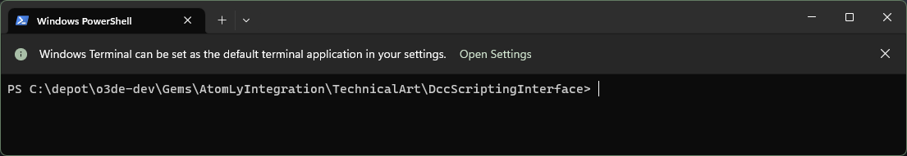
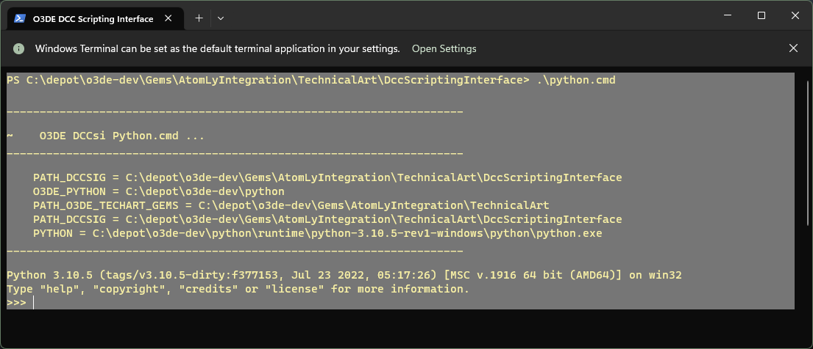
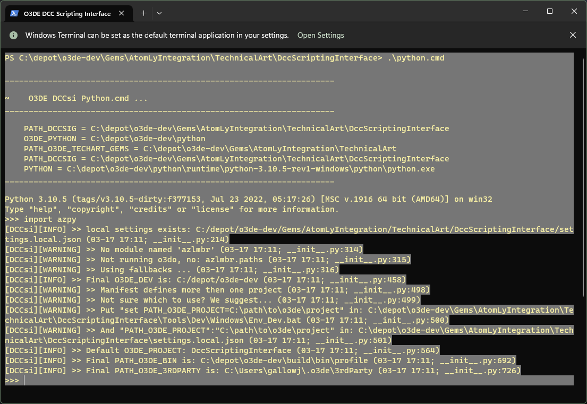

# DccScriptingInterface Troubleshooting

Are you having trouble with the DccScriptingInterface (DCCsi)?

This troubleshooting guide has some common steps you can take to diagnose (Windows only, other platforms not officially supported or tested yet.)

If you encounter bugs along the way, file them as a Github Issue:

[O3DE Bug Report](https://github.com/o3de/o3de/issues/new?assignees=&labels=needs-triage%2Cneeds-sig%2Ckind%2Fbug&template=bug_template.md&title=Bug+Report)

## DCCsi\Python.cmd

The DCCsi is located in a folder location similar to this (I have cloned the o3de engine source code to `C:\depot\o3de-dev`):

`C:\depot\o3de-dev\Gems\AtomLyIntegration\TechnicalArt\DccScriptingInterface`

In the root of the DCCsi are some utilities, one of them starts an O3DE Python Command Prompt in the local DCCsi environment context.

`DccScriptingInterface/python.cmd`

Open a new shell / terminal / command prompt in the DCCsi root



Try running

```shell
>.\python.cmd
```

You should see output similar to this



If any of the ENVARs printed out have paths that are missing or look suspect/incorrect, that would be an indication that you may need to do some configuration as a developer.

If you see this error, you need to first setup Python for O3DE itself:

```shell
Python not found in c:\path\to\o3de\python
Try running c:\path\to\o3de\python\get_python.bat first.
```

**Solution**:

1. Close the DCCsi Python Command Prompt

2. set up o3de Python by running c:\path\to\o3de\python\get_python.bat

3. Restart the DCCsi Python CMD (`DccScriptingInterface\python.cmd`)

Now you should be able to validate the DCCsi Python packages can be imported

```shell
>import azpy
```

You should see result similar to the following...



If things look good at this point, we want to stop the Python interpreter. In the CMD type `exit()`

```shell
>>>exit()
```

Now that we have ensured that the core O3DE Python is functional, we can move on.

## DCCsi\Foundation.py

The DCCsi requires some python package dependencies, and comes with a script utility to help manage the install of these dependencies (the script uses pip).  At the root of the DCCsi is a `requirements.txt` file, this is the python standard for tracking dependencies.  

Because most DCC apps have their own managed Python and may actually be on a different version of Python, even when a app is given access to the DCCsi the framework and/or APIs (like azpy) will fail - because of the missing dependencies.

`foundation.py` remedies this, it will install the `requirements.txt` into a managed folder within the DCCsi that is also procedurally bootstrapped, this folder is tied to the version of Python for the target application.

The next step to troubleshooting, is to run `foundation.py`

Open a new shell / terminal in the DCCsi

```shell
>.\python.cmd foundation.py
```

If this executes correctly you will see that is attempts to install the packages into a local sitedir folder where they can be sourced.  (You likely will need to do this separately for each python interpreter; the o3de python, each DCC tool, etc. )

The install target will be something like this, matching the python major.minor version

`target_loc = C:/path/to/o3de/Gems/AtomLyIntegration/TechnicalArt/DccScriptingInterface/3rdParty/Python/Lib/3.x/3.10.x/site-packages`

Examples of using `foundation.py` to install the dependencies for DCC tools:

```batch
.\python foundation.py -py="C:\Program Files\Blender Foundation\Blender 3.5\3.5\python\bin\python.exe"`
```

```batch
.\python foundation.py -py="C:\Program Files\Autodesk\Maya2023\bin\mayapy.exe"`
```

With packages installed from the `.\python.cmd` you should be able to access those packages, here are some examples of DCCsi dependencies...

```shell
>import dynaconf
>from box import Box
>exit()
```

## DCCsi\config.py

This step is optional, but allows additional customization of the configuration settings and ENVARs for the O3DE DccScriptingInterface; such as changing the folder location of  the engine source, build and bin folders, or overriding global settings.  It's also useful for diagnosing is something is not or can not properly be configured (which could cause a failure.)

`config.py` is based on [dynaconf](https://www.dynaconf.com/) a configuration management package for python.

By default it will:

- access:
  
  - `DccScriptingInterface\settings.json` (default settings)

- access is it exists (or generate):
  
  - `DccScriptingInterface\settings.local.json` (user settings overrides)
  
  - This file once generated, allows you to manually edit the JSON data in a text editor

This script also has a cli and you can run it from the DccScriptingInterface:

```shell
>.\python.cmd config.py
```

`config.py` also runs logical code, it attempts to ensure a default configuration in addition to loading the settings files, this can make it useful for troubleshooting and debugging the initial set up.  So if you are encountering issues it is suggested you run it and if needed log any bugs or issues related to faulty configuration.

If it runs successfully, it should write out a cached `settings.local.json` file. Inside are useful flags for troubleshooting a debugging, you might want to set (if you set them here, you will be setting them globally ... if you only want to set these for your IDE that is covered below.)

```json
{
    "DCCSI_DEV_MODE": "True",
    "DCCSI_GDEBUG": "True",
    "DCCSI_LOGLEVEL": 10
}
```

`"DCCSI_DEV_MODE": "True"` enables additional debug behavior

`"DCCSI_GDEBUG": "True"` will enable a dev mode that attempts to auto-attach a debugger (see the Wing setup as an example.)

`"DCCSI_LOGLEVEL": 10` enables more verbose debug logging statements

Other useful settings to inspect are:

`O3DE_DEV` is the folder of the engine source (this troubleshooting guide somewhat assumes you are developing in the source code, and working like a developer.)

`PATH_O3DE_BIN` should be the build path to your binaries and executables like `O3DE.exe` project manager.

## DCCsi\Tools\IDE\Wing\config.py

Although the plan is to include three or more IDE integrations for Technical Artists (VScode, PyCharm, and Wing IDE), the prototype was stood up with Wing and the others are not as mature.

This script is similar to the `DCCsi\config.py` but has Wing specific configuration and settings.  You can similar run it to run the logical code in the module and generate a settings file, which allows you to make Wing specific configuration and settings alterations.

This assumes you have Wing Pro IDE installed, the default supported version is Wing 8

```shell
>.\python.cmd Tools\IDE\Wing\config.py
```

That should generate: `DccScriptingInterface\Tools\IDE\Wing\settings.local.json`

If you want the debug and dev features to not be set globally, but only with Wing (or another IDE) this file is where you should enable those overrides.

## DCCsi\Tools\IDE\Wing\start.py

You can use the DCCsi framework to externally configure and start Wing IDE (and other supported tools), outside of the O3DE Editor.  This is very useful as a developer, if you are building for the DCCsi itself, or needing to troubleshoot and debug.

If you have the engine source setup properly, and have Wing Pro 8 installed, and it's configured, you should be able to use this script to successfully start the Wing IDE:

```shell
>.\python.cmd Tools\IDE\Wing\start.py
```

---

Copyright (c) Contributors to the Open 3D Engine Project. For complete
copyright and license terms please see the LICENSE at the root of this
distribution.

SPDX-License-Identifier: Apache-2.0 OR MIT
