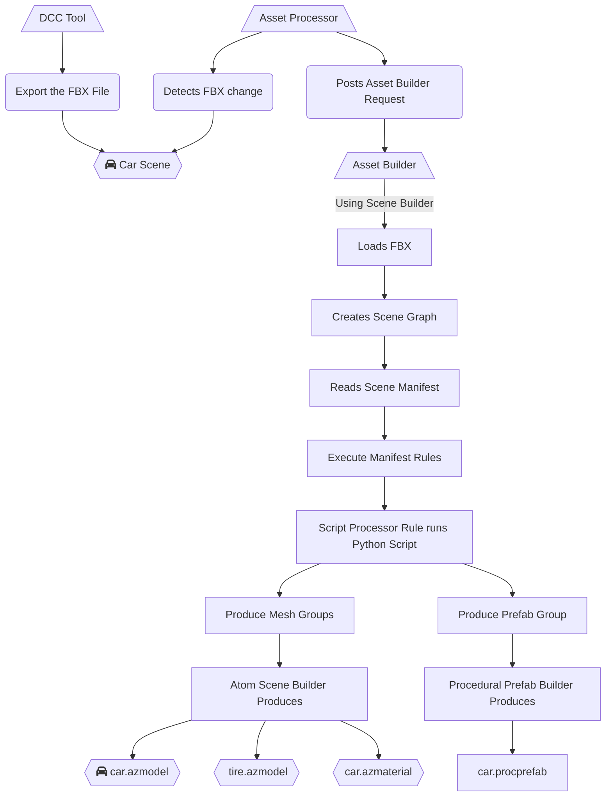

# Procedural Prefabs

The Prefab system allows Editor designers author entity/component hierarchy templates in the O3DE Editor. These Authored Prefab templates are used to speed up content creation work flows. The Procedural Prefab feature compliments the Authored Prefabs by allowing technical content developers (such as technical artists) to write Python scripts to write out prefab templates from incoming source scene assets. Procedural prefabs perform the same features as prefabs authored in the Editor (aka authored prefabs) such as acting as a collection of entities and components that can be instantiated in the Editor.

The Prefab gem provides these procedural prefab features:
- Adds the Prefab Group scene pipeline rules
- Enables the procedural prefab asset handling loading
- Enables the default procedural prefab product logic (can be toggled off)
- Adds some Editor content menus and save operations (can be toggled off)
- A Python API to enable scene building scripts to create Prefab Group rules

## Procedural Prefab System

The Procedural Prefab system allows a content team to author prefab templates from DCC tools like Maya or Blender source scene assets such as FBX files. When the default procedural prefab toggle is active the Prefab gem will create a procedural prefab asset to approximate the static mesh nodes from the DCC tool. The content team can further refine the procedural prefab assets by writing Python scripts that customize the scene builder pipeline to produce procedural prefab assets. 

The procedural prefab assets are read only in the Editor since they are meant to be changed in a DCC tool, not the Editor. When the Editor instantiates a procedural prefab asset in the scene, they are placed inside authored prefab templates (including the scene level since it is also a prefab template).

The procedural prefab assets come from a new scene manifest rule container called a Prefab Group. The only way to create a scene manifest Prefab Group is through a Python script or a C++ scene builder. The Prefab gem provides a default C++ scene builder that generates a default Prefab Group for a source scene asset.

This is an example of the usage where with a car scene from a DCC tool (i.e Maya, Blender) exports a car.fbx file.



## Prefab Groups

The scene pipeline consists of a scene graph (a hierarchy of nodes with content like mesh and transform data) and a scene manifest (a list of groups and rules to describe the relationships of the scene graph nodes). The Mesh Group is an example of a scene manifest rule; it describes collections of mesh nodes to be used written out as a model. 

The Prefab gem adds a new scene manifest container rule called the Prefab Group. A natural extension to the scene manifest is a rule to output a prefab product asset that describes entity-component trees backed by the source scene file. The Editor will be able to load this procedural prefab product asset to place into project scene levels.

The Prefab Group has three fields: **name**, **id**, and **prefabDomData**. The name and id field are meant to give the group a human readable name and a unique group ID from other groups, respectively. The prefabDomData is a JSON document that describes the entities, components, and properties for a prefab template. It is possible to create a JSON document manually to define the prefabDomData field, but the PythonAssetBuilder defines a number of helper classes to access the scene graph, create Editor entities, and add mesh asset references in Python.

## Prefab Asset Handling and Processing

The Prefab gem handles the procedural prefab asset processing, loading, presentation, and handling. 

The procedural prefabs are stored in the cache along with the rest of the product assets. When the scene builder is finished processing a source scene asset with a Prefab Group it will write out the procedural prefab product asset next to the source asset named the same as the Prefab Group’s name. 

For example, for a source asset “assets/scenery/house.fbx” with a Prefab Group named “my_house” will end up in the cache as a “assets/scenery/my_house.procprefab” product asset.

## Default Procedural Prefab Products

A default procedural prefab is a prefab template that approximates a source scene asset. The logic creates a Mesh Group for each mesh node in the scene; this generates a 3D model product asset for each mesh node. The nodes in the scene that have mesh data become entities in a scene with a mesh component. The node hierarchy is assembled by the node parent structure inside the source scene asset.

The Prefab gem will automatically create a default procedural prefab for each source scene asset (such as a STL or FBX file) if no scene manifest is discovered. More details on scene manifest settings file can be found at https://www.o3de.org/docs/user-guide/assets/scene-settings. 

This feature can be turned off globally or handled in the Edit Settings inside the O3DE Editor. To globally turn off the default procedural prefab logic, create a settings registry entry to set "O3DE/Preferences/Prefabs/CreateDefaults" field to false.

An example registry setting:
```
{
  "O3DE": {
    "Preferences": {
      "Prefabs": {
        "CreateDefaults": false
      }
    }
  }
}
```

## Procedural Prefab Editor Operations

The Prefab gem adds some Editor operation user interface options such as context menus. These menu options give the user different ways to use the procedural prefabs inside an Editor’s scene.

### Instantiate Procedural Prefab

The most common way to use a procedural prefab is to right-click in the 3D scene view and choose the "Instantiate Procedural Prefab..." option. It is also possible to select this menu option in the Entity Outliner.


Then "Pick Procedural Prefab" dialog will come up. The procedural prefab asset should be listed under the source scene asset file entry.


The procedural prefab should show up inside the authored prefab.


### Save Off Procedural Prefab

The Editor can save out a procedural prefab asset as an authored prefab source file as well. This allows Editor users to tweak a procedural prefab asset. The users should know that the prefab will get no updates from the procedural prefab once been saved off to an authored prefab.

The context menu item "Save as Prefab..." for the procedural prefab asset will prompt for a file name to save as an authored prefab.


